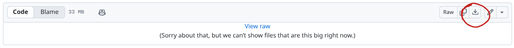

# 

## Installation
Go to [installations](./main/installations.md) to install the game.

After clicking on the version that you want, click the download icon on the file.

If you need to know how to play, click [here](https://github.com/EvanPlays676/3D-Video-Game/wiki/How-To-Play) to learn.

## Supported Operating Systems
* Windows (7 or later)
* macOS (10.12 or later)
* Linux
* Chrome OS

## Screenshots

